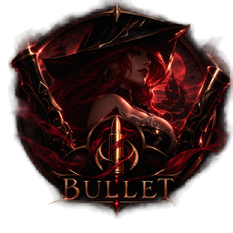

<p align="center">
  
</p>

<h1 align="center">Bullet</h1>

<p align="center">
  A League of Legends skin changer for Windows, written in Rust.<br>
  <em>The right skin loads into the match — every mode, every time.</em>
</p>

<p align="center">
  <a href="https://github.com/Isllanrx/Bullet/actions/workflows/ci.yml"></a>
  <a href="https://scorecard.dev/viewer/?uri=github.com/Isllanrx/Bullet"></a>
  <a href="https://github.com/Isllanrx/Bullet/releases/latest"></a>
  
  
  
  <a href="https://discord.gg/ASUW6J98jg"></a>
</p>

<p align="center">
  <a href="https://github.com/Isllanrx/Bullet/releases/latest"><b>Download</b></a> ·
  <a href="https://discord.gg/ASUW6J98jg"><b>Discord community</b></a> ·
  <a href="https://github.com/Isllanrx/Bullet/issues"><b>Report a bug</b></a>
</p>

---

Bullet lets you use any skin during a match. You pick the skin in Bullet's own window during champion select.
Bullet then builds a copy of the game files that contain it, and when the game starts it opens that copy instead
of its own files. The game installation itself is never modified.

Bullet began as a rewrite of [Rose](https://github.com/Alban1911/Rose), a Python project, and was rebuilt from
scratch in Rust with one goal: the skin you chose is the skin you get in every game mode.

> [!IMPORTANT]
> **Educational project.** Bullet is an improved skin changer built in Rust to study and demonstrate how such a
> tool can be engineered safely and reliably. It is provided as is, without warranty, and the author accepts
> no responsibility for any damage, account penalty or loss caused to you or to third parties by its use. See
> the [Disclaimer](#disclaimer).

## Contents

- [How it works](#how-it-works)
- [Status](#status)
- [Installation](#installation)
- [Usage](#usage)
- [Where Bullet keeps its files](#where-bullet-keeps-its-files)
- [Security and risk](#security-and-risk)
- [Troubleshooting](#troubleshooting)
- [Community](#community)
- [Contact](#contact)
- [Project layout](#project-layout)
- [Building from source](#building-from-source)
- [CI/CD](#cicd)
- [Acknowledgements](#acknowledgements)
- [Disclaimer](#disclaimer)
- [License](#license)

## How it works

A match goes through the following steps:

1. **Bullet follows the League client.** The client runs a small local web server, the LCU, on `127.0.0.1`.
   Bullet reads its port and password from the client's lockfile. It then subscribes to the client's events to
   learn the game phase, your team and the champion you are playing.
2. **You choose a skin in Bullet's window.** When champion select opens, Bullet attaches its own window next to
   the client and lists the skins and chromas for your champion. Nothing is injected into the client: no
   plugins and no scripts.
3. **Bullet builds an overlay.** It generates the skin from the game you have installed: the skin's files are
   written over the champion's default ones. Bullet then builds modified copies of the game's `.wad.client`
   archives. Each changed file is replaced, and every other file keeps the exact bytes the game shipped with.
   That byte-for-byte fidelity is why the game accepts the overlay after a patch.
4. **The injector is armed before the game exists.** Bullet starts the injector host while you are still in
   champion select, so it is waiting when the game process appears.
5. **The game reads the overlay.** The injector DLL attaches to the game and redirects the reads of the archives
   Bullet rebuilt to the overlay copies. The skin loads. Only you can see it.

Just before building the overlay, Bullet checks the client again for your champion and selection. That way a
late swap (ARAM bench, trades, a pick in the last second) is not lost.

## Status

| Area | State |
| --- | --- |
| Injection on the current patch | Proven in a live match, running without administrator rights |
| Draft and Ranked | Proven in a live match |
| Blind pick, ARAM, Swiftplay, Arena, rotating modes, reconnect | Implemented, still being validated mode by mode |
| Classic Rift (legacy champion models) | Generated from the installed game |
| Party mode (friends see each other's skins) | Works against the public relay; not yet proven with several players in one match |

> **Heads up:** the injector DLL only accepts game builds up to a fixed date: it refuses any game executable
> built after 2026-10-04 07:00 UTC. The build you have installed keeps working after that date. The first patch
> built later needs a refreshed DLL. Bullet checks this at startup and tells you.

## Installation

### Requirements

| Requirement | Notes |
| --- | --- |
| Windows 10 or 11, 64-bit | |
| [WebView2 Runtime](https://developer.microsoft.com/en-us/microsoft-edge/webview2/) | Already present on Windows 11. On Windows 10, install it if it is missing |
| League of Legends | Any install location. Bullet finds the game on its own |

### Steps

1. Download `Bullet-Setup-<version>-x64.exe` from [Releases](https://github.com/Isllanrx/Bullet/releases).
   Compare its hash with the `SHA256SUMS` file published next to it:

   ```powershell
   Get-FileHash .\Bullet-Setup-<version>-x64.exe -Algorithm SHA256
   ```

2. Run the installer. It installs Bullet to `Program Files\Bullet`.
3. Get the injector from an official [LTK Manager release](https://github.com/LeagueToolkit/ltk-manager/releases)
   and copy `ltk_patcher_host.exe` and `ltk_patcher_dll.dll` into `Program Files\Bullet\tools\`. They are not
   bundled because their license does not allow other projects to redistribute League Toolkit's signed
   binaries. Bullet checks both files' hashes before using them. If one is missing or is a different build,
   Bullet says so and shows the exact path it expected.
4. Start Bullet normally. Do not use "Run as administrator". It runs from the system tray.

Uninstalling removes the program, its tools, logs, cache and generated files. The uninstaller asks before it
deletes your own skin library.

## Usage

1. Open the League client and Bullet, in either order.
2. Enter champion select and pick a champion. Bullet's window lists the skins and chromas available for it.
3. Choose one. Bullet builds the overlay and arms the injector while you are still in champion select.
4. Play.

From the tray icon you can open the mods and logs folders, create or join a party, and turn on start with
Windows.

### Custom mods

Drop `.fantome` mods into the category folders under `%LOCALAPPDATA%\Bullet\custom_mods`. The categories are
`skins`, `maps`, `fonts`, `announcers`, `ui`, `voiceover`, `loading_screen`, `vfx`, `sfx` and `others`. Then
select them in the **Mods** tab of Bullet's window. You can pick at most one skin, one map, one font and one
announcer at a time. The other categories can be combined.

Before a mod is used, Bullet checks that every internal reference it contains still exists in the current
game. After a patch, a mod whose references are gone is left out, with a warning, so it cannot crash the
loading screen.

### Party mode

One player creates a room from the tray and shares the invite code. Up to five players can join. Each player's
chosen skin is encrypted on their own machine before it is sent. The relay only passes the encrypted messages
along and never sees who the players are or which skins they picked. Bullet only accepts a teammate's skin when
that teammate's champion matches the one the client reports for your team. A player cannot push a skin onto a
champion they are not playing.

### Environment variables

| Variable | Effect |
| --- | --- |
| `BULLET_LOG` | Log detail (`info` by default, `debug` to troubleshoot) |
| `BULLET_RELAY_URL` | Party relay to use instead of the default one |
| `BULLET_SKIN_SYNC` | Set to `1` to download a shared skin library in the background |
| `BULLET_PATCHER_FLAGS` | Advanced: numeric hook flags passed to the injector host |

## Where Bullet keeps its files

```text
C:\Program Files\Bullet\              installed program (read-only for users)
├── bullet.exe
├── assets\bullet.ico
└── tools\                           injector: ltk_patcher_host.exe, ltk_patcher_dll.dll

%LOCALAPPDATA%\Bullet\                 everything Bullet writes, per Windows user
├── logs\                            daily logs, bullet.log.YYYY-MM-DD, last 7 days kept
├── custom_mods\                     your .fantome mods, one folder per category:
│   ├── skins\   maps\   fonts\   announcers\   ui\
│   └── voiceover\   loading_screen\   vfx\   sfx\   others\
├── library\                         skin library (generated or synced)
├── mods\                            mods generated from the game for the current match
├── overlay\                         built overlays, reused while the game build is unchanged
├── state\                           settings, party.json, selections
└── webview2\                        data of the selection window
```

- **Open them from the tray icon:** it has entries for the mods folder and the logs folder.
- **Logs** are the first thing to check, and to attach, when something fails. `BULLET_LOG=debug` adds
  detail.
- **Tools** are looked for in `Program Files\Bullet\tools`, then in a `tools` folder next to `bullet.exe`, then
  in `%LOCALAPPDATA%\Bullet\tools`. Wherever they are found, they are only used if their SHA-256 matches the
  audited build. A file from another product's folder is never loaded.
- **The game folder is never written to.** Deleting `%LOCALAPPDATA%\Bullet` resets Bullet completely; the
  uninstaller does it for you.

## Security and risk

### What Bullet does to keep you safe

- It runs as a normal user and never asks for administrator rights.
- It only loads its injector from its own folders, never from another product's. Before loading it, Bullet
  checks the file's SHA-256 hash against the one built into Bullet. A file that has been swapped is refused
  and logged.
- It never writes to the game folder. Everything it generates lives in `%LOCALAPPDATA%\Bullet`.
- It collects no telemetry. It only talks to the League client on your own machine and, in party mode, to the
  relay. The relay only receives encrypted data.
- Every failure is logged with its cause in `%LOCALAPPDATA%\Bullet\logs`.

### What you should know

- The injector **is** a DLL loaded into the game, the same technique used by cslol-manager and LTK Manager. It
  changes which files the game opens. It does not touch game logic or game memory in any other way.
- No tool of this kind comes with a guarantee against penalties. **Use it at your own risk.**
- Windows SmartScreen may warn about the installer until it is code-signed.

Please report security issues privately through
[GitHub Security Advisories](https://github.com/Isllanrx/Bullet/security/advisories/new), not in public issues.

## Troubleshooting

| Symptom | What to check |
| --- | --- |
| Bullet says a tool is missing or does not match | The file in `Program Files\Bullet\tools` is missing or is a different build; the message shows the path |
| The skin does not show up in game | Set `BULLET_LOG=debug`, play again, and read the latest log in `%LOCALAPPDATA%\Bullet\logs` |
| The game opens its repair screen | Update Bullet, then report it with Bullet's log and the game's log from the same match |
| After a patch the injector refuses the game | The DLL does not support the new game build yet; a refreshed DLL is needed |

When you open an issue, attach the Bullet log from the match where it failed. Without it the problem is
usually impossible to diagnose. For quick help, ask on [Discord](https://discord.gg/ASUW6J98jg).

## Community

Join the **[Bullet Discord](https://discord.gg/ASUW6J98jg)** to get help with setup, report what works in each game mode, share
custom mods and hear about new builds first. Pre-releases are announced there before they are promoted, so
it is the best place to help test them.

Bugs with a log attached are best reported as [GitHub issues](https://github.com/Isllanrx/Bullet/issues).
Want to help build it? Read [CONTRIBUTING.md](CONTRIBUTING.md). Everyone is expected to follow the
[Code of Conduct](CODE_OF_CONDUCT.md).

If Bullet is useful to you, **a star on GitHub** helps other players find it.

## Contact

The project is maintained by **Isllan Toso**: [isllan.dev](https://isllan.dev/).

For help and bug reports, the [Discord community](https://discord.gg/ASUW6J98jg) and
[GitHub issues](https://github.com/Isllanrx/Bullet/issues) are the fastest routes. Security issues go through a
[private advisory](https://github.com/Isllanrx/Bullet/security/advisories/new).

## Project layout

Bullet is a Cargo workspace. Each crate has its own README with its role in the flow above.

| Module | Role |
| --- | --- |
| [`bullet-core`](crates/bullet-core) | Shared vocabulary: app state, game phases, champions, mods, task supervision |
| [`bullet-platform`](crates/bullet-platform) | Everything Windows: finding the game, processes, windows, tray, translations |
| [`bullet-wad`](crates/bullet-wad) | Reads and writes the game's archive and data formats |
| [`bullet-lcu`](crates/bullet-lcu) | Talks to the League client: phases, champion select, skin registration |
| [`bullet-classic`](crates/bullet-classic) | Generates skins and Classic Rift models from the installed game |
| [`bullet-inject`](crates/bullet-inject) | Builds the overlay and drives the injector |
| [`bullet-party`](crates/bullet-party) | Encrypted party rooms over a relay |
| [`bullet-relay`](crates/bullet-relay) | Optional self-hosted relay server |
| [`bullet-app`](crates/bullet-app) | The executable: wires everything together and decides when to inject |
| [`xtask`](xtask) | Build, packaging and diagnostic commands |
| [`relay-worker`](relay-worker) | The public party relay, running on Cloudflare Workers |
| [`installer`](installer) | Inno Setup script for the Windows installer |

Dependencies only flow in one direction. `bullet-core` and `bullet-wad` depend on no other Bullet crate. The
platform, LCU and party crates build on the core. `bullet-classic` builds on the WAD crate, `bullet-inject` on
the core, platform and WAD crates, and `bullet-app` on all of them.

## Building from source

You need Rust stable (the exact toolchain is pinned in `rust-toolchain.toml`, target `x86_64-pc-windows-msvc`).
To build the installer you also need [Inno Setup 6](https://jrsoftware.org/isinfo.php).

```powershell
cargo build --release     # target\x86_64-pc-windows-msvc\release\bullet.exe
cargo xtask check         # formatting, clippy with warnings as errors, tests, error-handling sweep
cargo deny check          # security advisories, licenses, banned crates, sources
cargo xtask package       # dist\ with checksums
cargo xtask installer     # dist\installer\Bullet-Setup-<version>-x64.exe
```

A passing build is not the finish line. A change that affects what happens inside the game is only done once
it has been seen working in a real match, with the log to prove it.

## CI/CD

Pull requests are checked automatically, and after a maintainer approves one it merges and ships on its own,
with safety nets in case the approval was a mistake.

| Workflow | Runs on | What it does |
| --- | --- | --- |
| [`ci.yml`](.github/workflows/ci.yml) | Every push and pull request | Tests on Windows, release build with metadata and manifest checks, dependency audit, relay typecheck, workflow lint and audit |
| [`security.yml`](.github/workflows/security.yml) | Pull requests, `main`, weekly | CodeQL, secret scan over the whole history, dependency review |
| [`pr-approved.yml`](.github/workflows/pr-approved.yml) and [`automerge.yml`](.github/workflows/automerge.yml) | A maintainer's approval | Re-check the approval and enable auto-merge; GitHub merges only when every required check passes |
| [`release.yml`](.github/workflows/release.yml) | A merge that changes the version | Builds the installer from scratch, attests its provenance and publishes a **pre-release** |
| [`promote.yml`](.github/workflows/promote.yml) | Manual, gated by a reviewer | Verifies checksums and provenance, then marks the pre-release as the latest release |
| [`dependabot.yml`](.github/dependabot.yml) | Weekly and monthly | Proposes updates for actions, crates and relay dependencies |

Every action is pinned to an exact commit, and every job starts read-only. Auto-merge never merges a commit
pushed after the approval or a change to the workflows, the installer, the trusted hashes or the injector
code paths. Those are merged by hand. A new build always starts as a pre-release and only becomes the release
users are pointed at after it has been tested in a real match.

### Publishing a release

1. Bump `version` under `[workspace.package]` in the root `Cargo.toml` in a pull request.
2. Once it merges, the pre-release `v<version>` is built and published automatically.
3. Test it in a real match, then run **Promote release** from the Actions tab with that tag.

The one-time repository setup (GitHub App, ruleset, `production` environment) is described in
[docs/build-and-ci.md](docs/build-and-ci.md).

## Acknowledgements

Bullet was built by studying these open projects:

| Project | What Bullet learned from it |
| --- | --- |
| [Rose](https://github.com/Alban1911/Rose) — Alban1911 | The original project: how champion select behaves and how the overlay should work |
| [ame](https://github.com/hoangvu12/ame) · [bocchi](https://github.com/hoangvu12/bocchi) — hoangvu12 | Arming the injector during champion select, skin history per champion, client API details |
| [ltk-manager](https://github.com/LeagueToolkit/ltk-manager) — LeagueToolkit | The injector Bullet uses today (`ltk_patcher_host` and `ltk_patcher_dll`) |
| [cslol-manager](https://github.com/LeagueToolkit/cslol-manager) — LeagueToolkit | The overlay algorithm Bullet's builder reproduces, and the `.fantome` format |
| [wadtools](https://github.com/LeagueToolkit/wadtools) — LeagueToolkit | The WAD archive format |
| [cdragon-rs](https://github.com/CommunityDragon/cdragon-rs) — CommunityDragon | WAD and BIN formats, hash tables |
| [cdragon-rs](https://github.com/Crauzer/cdragon-rs) · [Obsidian](https://github.com/Crauzer/Obsidian) · [Data](https://github.com/Crauzer/Data) · [ritobin-lsp](https://github.com/Crauzer/ritobin-lsp) — Crauzer | BIN format details, WAD internals, champion hash tables |
| [RitoClient](https://github.com/nomi-san/RitoClient) · [riot-client-schema](https://github.com/nomi-san/riot-client-schema) · [balance-buff-viewer](https://github.com/nomi-san/balance-buff-viewer) · [old-league-loader-web](https://github.com/nomi-san/old-league-loader-web) — nomi-san | How the League client is put together (studied only, not used) |
| [PenguLoader](https://github.com/PenguLoader/PenguLoader) · [pengu-rust](https://github.com/PenguLoader/pengu-rust) — PenguLoader | How client plugins are loaded (studied only, not used or shipped) |

No GPL code was copied. Where a reference is GPL-licensed, Bullet reimplements the behavior independently.

Bullet is not affiliated with or endorsed by Riot Games. League of Legends is a trademark of Riot Games, Inc.

## Disclaimer

Bullet is published **for educational purposes**. It is an improved skin changer written in Rust: a study of
how to build this kind of tool with safer engineering, including no administrator rights, verified binaries,
no telemetry and no writes to the game folder. It is not a commercial product and is not meant to give anyone
an advantage in the game.

- The software is provided **"as is", without warranty of any kind**, as stated in the MIT license.
- **The author assumes no responsibility** for any direct or indirect damage caused by using, modifying or
  redistributing it. This includes account suspensions or bans, data loss, damage to the game installation,
  and any harm to third parties.
- Using third-party software with League of Legends goes against Riot Games' Terms of Service. **You decide
  whether to use it, and you bear the consequences.**
- Bullet only changes what you see on your own machine. It gives no gameplay advantage and must not be used to
  harm other players, services or accounts.
- Bullet is not affiliated with, endorsed by or sponsored by Riot Games. League of Legends and all related
  names and assets are trademarks of Riot Games, Inc.

## License

Bullet's source code is released under the [MIT License](LICENSE).

The LTK patcher binaries (`ltk_patcher_host.exe`, `ltk_patcher_dll.dll`) are not part of this repository or
of the MIT license. They are governed by the LTK Patcher License from League Toolkit. That license, and the
licenses of every other third-party component, are listed in [THIRD-PARTY-NOTICES.md](THIRD-PARTY-NOTICES.md).
Security reports: [SECURITY.md](SECURITY.md).
